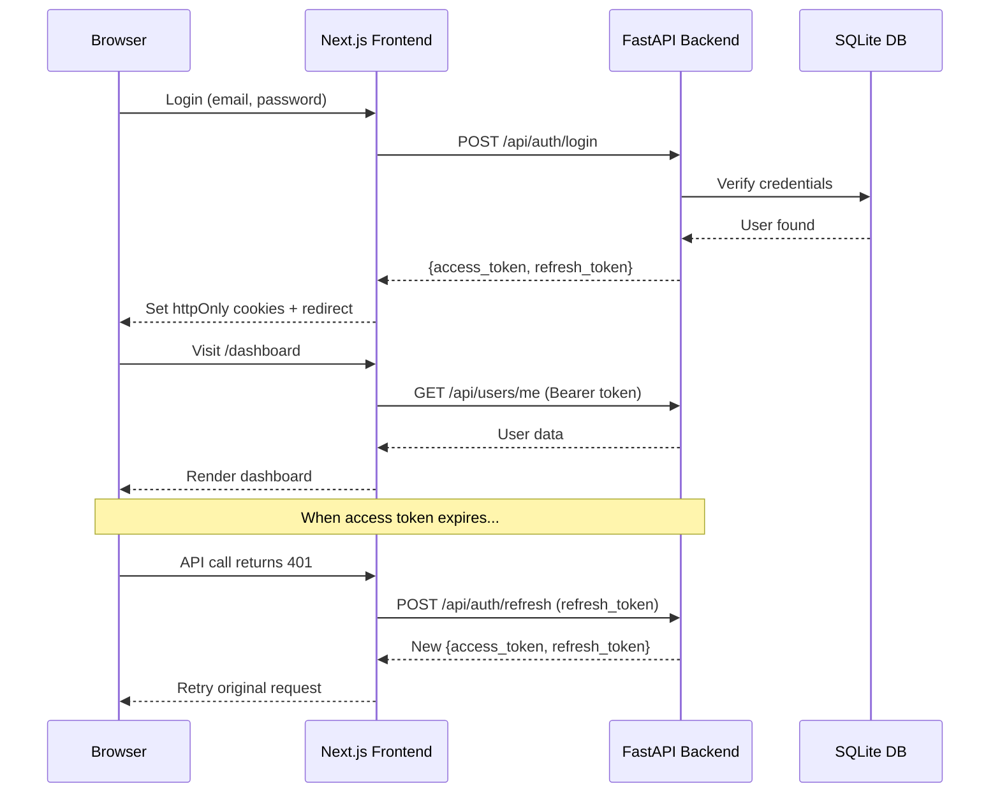

# Full-Stack JWT Authentication App (FastAPI + Next.js)

Build a secure authentication system with access tokens and refresh tokens, using FastAPI as the backend API and Next.js as the frontend.

## Architecture Overview



## Tech Stack

| Layer | Technology | Purpose |
|-------|-----------|---------|
| **Backend** | FastAPI + Python 3.13 | REST API server |
| **Database** | SQLite + SQLAlchemy | User storage, refresh token tracking |
| **Auth** | python-jose (JWT), passlib + bcrypt | Token signing, password hashing |
| **Frontend** | Next.js 14 (App Router) | UI with server-side auth management |
| **Styling** | Vanilla CSS | Premium dark-mode UI |

## Security Design

- **Access Token**: JWT, 15-minute expiry, sent as `Authorization: Bearer` header
- **Refresh Token**: JWT, 7-day expiry, stored in httpOnly cookie + tracked in DB
- **Refresh Token Rotation**: Each refresh issues a new refresh token and invalidates the old one
- **Password Hashing**: bcrypt via passlib
- **CORS**: Configured for Next.js origin only

## Proposed Changes

### Backend (`backend/`)

#### [NEW] backend/requirements.txt
Dependencies: fastapi, uvicorn, sqlalchemy, python-jose[cryptography], passlib[bcrypt], python-multipart, pydantic-settings

#### [NEW] backend/.env
Environment variables: SECRET_KEY, DATABASE_URL, ACCESS_TOKEN_EXPIRE_MINUTES, REFRESH_TOKEN_EXPIRE_DAYS, FRONTEND_URL

#### [NEW] backend/app/main.py
FastAPI app entry point with CORS middleware configuration

#### [NEW] backend/app/config.py
Pydantic Settings class loading from .env

#### [NEW] backend/app/database.py
SQLAlchemy engine, session, and Base setup (SQLite)

#### [NEW] backend/app/models.py
SQLAlchemy models:
- `User` — id, email, hashed_password, full_name, is_active, created_at
- `RefreshToken` — id, token_jti, user_id, expires_at, is_revoked, created_at

#### [NEW] backend/app/schemas.py
Pydantic schemas for request/response: UserCreate, UserLogin, UserResponse, TokenResponse, TokenPayload

#### [NEW] backend/app/auth.py
JWT utility functions:
- `create_access_token(user_id)` — 15 min expiry
- `create_refresh_token(user_id)` — 7 day expiry, with JTI
- `verify_token(token, token_type)` — decode + validate type claim
- `hash_password()` / `verify_password()`

#### [NEW] backend/app/dependencies.py
FastAPI dependencies:
- `get_db()` — database session
- `get_current_user()` — validates access token from Authorization header

#### [NEW] backend/app/routers/auth.py
Auth endpoints:
- `POST /api/auth/register` — create user, return tokens
- `POST /api/auth/login` — validate credentials, return tokens
- `POST /api/auth/refresh` — validate refresh token, rotate, return new pair
- `POST /api/auth/logout` — revoke refresh token

#### [NEW] backend/app/routers/users.py
User endpoints:
- `GET /api/users/me` — return current user profile (protected)

---

### Frontend (`frontend/`)

#### [NEW] frontend/ (Next.js project via create-next-app)
Initialized with App Router, TypeScript, vanilla CSS

#### [NEW] frontend/src/app/globals.css
Premium dark-mode design system:
- CSS custom properties for colors, spacing, typography
- Glassmorphism card styles
- Animated gradient backgrounds
- Form input styles with focus animations
- Button styles with hover/active states
- Toast notification styles

#### [NEW] frontend/src/lib/api.ts
API client with automatic token refresh:
- `fetchWithAuth()` — attaches access token, auto-retries on 401
- `login()`, `register()`, `logout()`, `refreshToken()`, `getMe()`

#### [NEW] frontend/src/context/AuthContext.tsx
React context for auth state:
- `user`, `isLoading`, `isAuthenticated`
- `login()`, `register()`, `logout()` methods
- Auto-check session on mount
- Token refresh on 401

#### [NEW] frontend/src/app/layout.tsx
Root layout with AuthProvider, Google Fonts (Inter), global styles

#### [NEW] frontend/src/app/page.tsx
Landing/home page — redirects to dashboard if authenticated, otherwise shows hero

#### [NEW] frontend/src/app/login/page.tsx
Login page with:
- Email/password form with validation
- Animated card with glassmorphism
- Link to register
- Error display with toast

#### [NEW] frontend/src/app/register/page.tsx
Register page with:
- Full name, email, password, confirm password fields
- Client-side validation
- Matching design to login page

#### [NEW] frontend/src/app/dashboard/page.tsx
Protected dashboard showing:
- Welcome message with user's name
- User profile card
- Account info (email, member since)
- Logout button
- Token status indicator

#### [NEW] frontend/src/middleware.ts
Next.js middleware to:
- Check for access_token cookie on protected routes
- Redirect unauthenticated users to /login
- Redirect authenticated users away from /login and /register

#### [NEW] frontend/src/app/api/auth/[...action]/route.ts
Next.js API route handler acting as a proxy to FastAPI:
- Sets/clears httpOnly cookies for access and refresh tokens
- Proxies login, register, refresh, and logout requests

## Project Structure

```
├── backend/
│   ├── .env
│   ├── requirements.txt
│   └── app/
│       ├── __init__.py
│       ├── main.py
│       ├── config.py
│       ├── database.py
│       ├── models.py
│       ├── schemas.py
│       ├── auth.py
│       ├── dependencies.py
│       └── routers/
│           ├── __init__.py
│           ├── auth.py
│           └── users.py
└── frontend/
    ├── package.json
    ├── next.config.js
    └── src/
        ├── middleware.ts
        ├── context/
        │   └── AuthContext.tsx
        ├── lib/
        │   └── api.ts
        └── app/
            ├── layout.tsx
            ├── globals.css
            ├── page.tsx
            ├── login/
            │   └── page.tsx
            ├── register/
            │   └── page.tsx
            ├── dashboard/
            │   └── page.tsx
            └── api/
                └── auth/
                    └── [...action]/
                        └── route.ts
```

## Verification Plan

### Local Installation for backend
1. cd backend
2. uv venv
3. source .venv/Scripts/activate
4. uv pip install -r requirements.txt

### Local Installation for frontend
1. cd frontend

### Automated Tests
1. Start FastAPI backend: `uvicorn app.main:app --reload --port 8000`
2. Start Next.js frontend: `npm run dev` (port 3000)
3. Test the full flow in the browser:
   - Register a new user
   - Login with credentials
   - View dashboard (protected route)
   - Logout and verify redirect
   - Verify unauthorized access is blocked

### Manual Verification
- Verify access token expiry triggers automatic refresh
- Verify refresh token rotation (old refresh token cannot be reused)
- Verify httpOnly cookies are set correctly in browser DevTools
